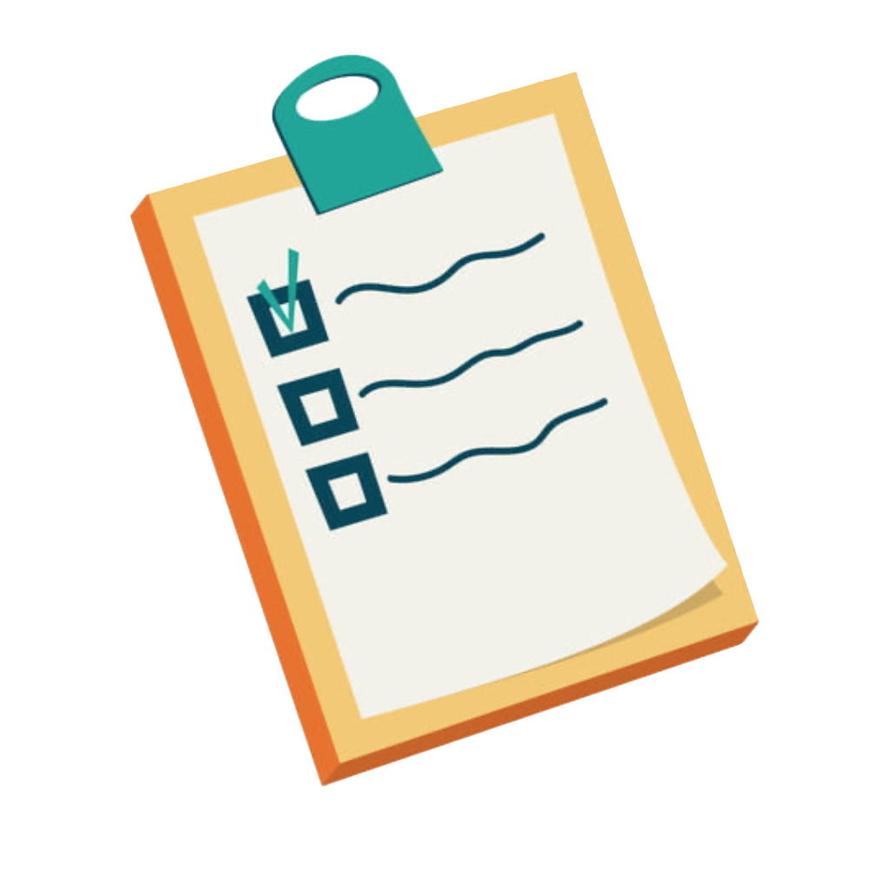

<div align="center">

<h1> ToDoList </h1>
</div>


<p align="justify">Это простое приложение, в котором возможно отмечать выполнение предустановленных задач.</p>
<p align="justify">Задачи разделяются на простые и сложные, просроченные задачи отмечаются красным цветом.</p>

## L1M4 Home Work
- [x] Архитектура приложения CleanSwift

## Getting Started

```
# Move into a directory to store the project
cd ~/Developer
# Clone project
git clone https://github.com/logunkov/HWToDoList.git
# Move into Project directory
cd ./HWToDoList
# Open a project in Xcode 
```
## Features

- [x] Отображение меню авторизации
- [x] Отображение списка задач с разбиением на секции по критерию выполненности.
- [x] Поддержка двух типов задач: обычных и важных.
- [x] У важных задач есть 3 варианта приоритета: высокий, средний и низкий.
- [x] Задачи сортируются по приоритету.
- [x] Возможность менять состояние выполненности задач.
- [x] Подсветка просроченных задач.

## Component Libraries
- [x] Написано на Swift 5.
- [x] Поддерживается версия iOS 14.
- [x] Зависимостей от сторонних библиотек нет.
- [x] Необходим Xcode 14 или выше.
